## 由于GooglePlay现在禁止非相册类或者视频音频编辑类App再使用，图片，视频，音频权限。导致三方相册库均无法使用，所以我在本库的基础上，Android13以上图片，视频的选择使用原生的PhotoPicker，但是后续裁切和压缩依然使用本库。

## Chooser是对Selector的封装，导入Chooser会自动导入Selector，Chooser只适配了图片选择器，图片裁切，图片压缩等主流的设置选项。如果你有图片水印之类的需求那你继续用Selector就行。至于适配我没看过我不知道。如果你有视频类更详细的配置，我也没适配，走的Selector默认逻辑。

## 20250831小告知：随着静心重写了Chooser的逻辑，现在已经还原了Selector原本的代码书写逻辑，Selector怎么用Chooser就怎么用。并且也适配到Android16，媒体选择这部分我预测短时间内Google不会再进行任何改动。我个人也因突发工作变动不再负责Android方面的开发，所以不会追着Android版本改动留意项目的适配度。所以本项目至此大概率彻底完结。以上。


## 更新日志

### 2025.08.31
- chooser 发布到`1.0.6`，解除`ActivityForResult`对`Activity->onCreate()`的硬绑定关系，现在可以在任意位置初始化PicChooser
- ucrop 升级到`v3.11.7`，解除`ActivityForResult`对`Activity->onCreate()`的硬绑定关系，现在可以在任意位置初始化PicChooser

### 2025.07.21
- chooser 发布到`1.0.5`，适配`Android16`，适配16K Page Size
- ucrop 升级到`v3.11.6`，适配`Android16`，适配16K Page Size
- camerax 升级到`v3.11.5`，适配`Android16`，适配16K Page Size
- compress 升级到`v3.11.3`，适配`Android16`，适配16K Page Size

### before
- chooser 发布到`1.0.3`，封装原库的selector，Andriod13以上使用`PhotoPicker`，以下使用selector
- ucrop 升级到`v3.11.3`，适配`Android15`的Edge2Edge
- camerax 升级到`v3.11.3`，适配`Android15`的Edge2Edge
- ucrop 升级到`v3.11.4`，适配折叠屏

# 简易使用说明
- 引用方法(这里才是最新版本)
```sh
repositories {
  google()
  mavenCentral()
}
 
dependencies {
  // PictureSelector basic (Necessary)
  implementation 'io.github.liyuhaolol:PictureChooser:1.0.6'

  // image compress library (Not necessary)
  implementation 'io.github.liyuhaolol:compress:v3.11.3'

  // uCrop library (Not necessary)
  implementation 'io.github.liyuhaolol:ucrop:v3.11.7'

  // simple camerax library (Not necessary)
  implementation 'io.github.liyuhaolol:camerax:v3.11.5'
}
```
- 原作者的PictureSelector使用方法和功能完全没有改动，可以继续按照原逻辑使用
- Chooser仅跟进适配了图片，视频的单选多选，裁剪和压缩。其余功能均未适配。
- 需要的权限
```sh
<uses-permission android:name="android.permission.READ_EXTERNAL_STORAGE" 
      android:maxSdkVersion="28"/>
<uses-permission android:name="android.permission.WRITE_EXTERNAL_STORAGE" 
      android:maxSdkVersion="32"/>
<uses-permission android:name="android.permission.RECORD_AUDIO" />可选
<uses-permission android:name="android.permission.CAMERA" />可选
<uses-permission android:name="android.permission.VIBRATE" />可选
```
- 只有在Android13以下才需要请求`android.permission.READ_EXTERNAL_STORAGE`权限，PhotoPicker选取图片不需要任何权限
- 方法调用
```sh
          PicChooser
            .with(this)
            .setImageEngine(GlideEngine.createGlideEngine())
            .openGallery(SelectMimeType.ofImage())
            .isGif(false)
            .setSelectionMode(SelectModeConfig.MULTIPLE)
            .setMaxSelectNum(5)
            .setSelectorUIStyle(UpPictureSelectorStyle())
            .setOpenGalleryEngine(AndroidGalleryEngine())
            .setCropEngine(ImageFileCropEngine())
            .setCompressEngine(ImageFileCompressEngine())
            .forResult(object : OnResultCallbackListener<LocalMedia?> {
                override fun onResult(result: ArrayList<LocalMedia?>?) {
                  
                }
                override fun onCancel() {
                  
                }
            })
```
- 注意事项
- 1，具体逻辑可以看`TestActivity``Test2Fragment`和`com.luck.pictureselector.newlib`下的文件，那些文件也是按照本库之前的范例进行了一些适配修改，复制粘贴即可。
- 其他玩意并不想解答，如果你发现不能用，或者用着不舒服就去自己魔改吧，我这里不接受，也没法接受任何issues。毕竟是clone的别人的项目。


- 下面是项目原本的说明了！

   [简体中文🇨🇳](README_CN.md)

   [Download Demo Apk](https://github.com/LuckSiege/PictureSelector/raw/version_component/app/demo/demo_2023-12-17_060744_v3.11.2.apk)<br>

[](https://github.com/LuckSiege)
[](https://github.com/LuckSiege)
[](https://github.com/LuckSiege/PictureSelector)


## Contents
-[Latest version](https://github.com/LuckSiege/PictureSelector/releases/tag/v3.11.2)<br>
-[Download](#Download)<br>
-[Usage](#Usage)<br>
-[Permission](#Permission)<br>
-[Result description](https://github.com/LuckSiege/PictureSelector/wiki/PictureSelector-3.0-LocalMedia%E8%AF%B4%E6%98%8E)<br>
-[Effect](#Effect)<br>
-[ProGuard](#ProGuard)<br>
-[Common errors](https://github.com/LuckSiege/PictureSelector/wiki/PictureSelector-3.0-%E5%B8%B8%E8%A7%81%E9%94%99%E8%AF%AF)<br>
-[Issues](https://github.com/LuckSiege/PictureSelector/wiki/%E5%A6%82%E4%BD%95%E6%8F%90Issues%3F)<br>
-[License](#License)<br>


## Download

Use Gradle

```sh
repositories {
  google()
  mavenCentral()
}

dependencies {
  // PictureSelector basic (Necessary)
  implementation 'io.github.lucksiege:pictureselector:v3.11.2'

  // image compress library (Not necessary)
  implementation 'io.github.lucksiege:compress:v3.11.2'

  // uCrop library (Not necessary)
  implementation 'io.github.lucksiege:ucrop:v3.11.2'

  // simple camerax library (Not necessary)
  implementation 'io.github.lucksiege:camerax:v3.11.2'
}
```

Kotlin Version [Demo](https://github.com/LuckSiege/PictureSelector/tree/master)

```sh
dependencies {
  // Please do not upgrade across versions, please check the Kotlin version demo first
  implementation 'io.github.lucksiege:pictureselector:kotlin-v1.0.0-beta'
}
```

Or Maven:

```sh
<dependency>
  <groupId>io.github.lucksiege</groupId>
  <artifactId>pictureselector</artifactId>
  <version>v3.11.2</version>
</dependency>

<dependency>
  <groupId>io.github.lucksiege</groupId>
  <artifactId>compress</artifactId>
  <version>v3.11.2</version>
</dependency>

<dependency>
  <groupId>io.github.lucksiege</groupId>
  <artifactId>ucrop</artifactId>
  <version>v3.11.2</version>
</dependency>

<dependency>
  <groupId>io.github.lucksiege</groupId>
  <artifactId>camerax</artifactId>
  <version>v3.11.2</version>
</dependency>
```

## Permission  

Permission describe，see [documentation](https://github.com/LuckSiege/PictureSelector/wiki/PictureSelector-3.0-%E6%9D%83%E9%99%90%E4%BD%BF%E7%94%A8%E8%AF%B4%E6%98%8E)

```sh
<uses-permission android:name="android.permission.READ_EXTERNAL_STORAGE" />
<uses-permission android:name="android.permission.WRITE_EXTERNAL_STORAGE" />
<uses-permission android:name="android.permission.WRITE_MEDIA_STORAGE" />
<uses-permission android:name="android.permission.WRITE_SETTINGS" />
<uses-permission android:name="android.permission.MODIFY_AUDIO_SETTINGS" />
<uses-permission android:name="android.permission.MANAGE_EXTERNAL_STORAGE" />
<uses-permission android:name="android.permission.FOREGROUND_SERVICE" />
<uses-permission android:name="android.permission.RECORD_AUDIO" />
<uses-permission android:name="android.permission.CAMERA" />
<uses-permission android:name="android.permission.VIBRATE" />

Android 13版本适配，细化存储权限
<uses-permission android:name="android.permission.READ_MEDIA_IMAGES" />
<uses-permission android:name="android.permission.READ_MEDIA_AUDIO" />
<uses-permission android:name="android.permission.READ_MEDIA_VIDEO" />
```

Android 11 use camera，AndroidManifest.xm add the code：

```sh
<queries package="${applicationId}">
    <intent>
        <action android:name="android.media.action.IMAGE_CAPTURE">

        </action>
    </intent>
    <intent>
        <action android:name="android.media.action.ACTION_VIDEO_CAPTURE">

        </action>
    </intent>
</queries>
```

## ImageEngine
[GlideEngine](https://github.com/LuckSiege/PictureSelector/blob/version_component/app/src/main/java/com/luck/pictureselector/GlideEngine.java)<br> 
[PicassoEngine](https://github.com/LuckSiege/PictureSelector/blob/version_component/app/src/main/java/com/luck/pictureselector/PicassoEngine.java)<br>
[CoilEngine](https://github.com/LuckSiege/PictureSelector/blob/version_component/app/src/main/java/com/luck/pictureselector/CoilEngine.java)<br>

## Usage
For more features, see [documentation](https://github.com/LuckSiege/PictureSelector/wiki/PictureSelector-3.0-%E5%8A%9F%E8%83%BDapi%E8%AF%B4%E6%98%8E)

A simple use case is shown below:

1、Get picture 

```sh
PictureSelector.create(this)
   .openGallery(SelectMimeType.ofImage())
   .setImageEngine(GlideEngine.createGlideEngine())
   .forResult(new OnResultCallbackListener<LocalMedia>() {
      @Override
      public void onResult(ArrayList<LocalMedia> result) {

      }

      @Override
      public void onCancel() {

     }
});
```

Using system albums

```sh
PictureSelector.create(this)
     .openSystemGallery(SelectMimeType.ofImage())
     .forResult(new OnResultCallbackListener<LocalMedia>() {
        @Override
        public void onResult(ArrayList<LocalMedia> result) {

        }

        @Override
        public void onCancel() {

        }
});
```

2、Only use camera

```sh
PictureSelector.create(this)
     .openCamera(SelectMimeType.ofImage())
     .forResult(new OnResultCallbackListener<LocalMedia>() {
        @Override
        public void onResult(ArrayList<LocalMedia> result) {

        }

        @Override
        public void onCancel() {

        }
});
```

To take photos separately in the Navigation Fragment scene, please use the following methods:

```sh
PictureSelector.create(this)
     .openCamera(SelectMimeType.ofImage())
     .forResultActivity(new OnResultCallbackListener<LocalMedia>() {
        @Override
        public void onResult(ArrayList<LocalMedia> result) {

        }

        @Override
        public void onCancel() {

        }
});
```

3、You can also use the following example：

(1)、Inject into any view fragment

```sh

PictureSelector.create(this)
   .openGallery(SelectMimeType.ofAll())
   .setImageEngine(GlideEngine.createGlideEngine())
   .buildLaunch(R.id.fragment_container, new OnResultCallbackListener<LocalMedia>() {
      @Override
      public void onResult(ArrayList<LocalMedia> result) {
      
      }

      @Override
      public void onCancel() {
      
      }
});
			
```

(2)、Custom Inject into any view fragment

```sh

PictureSelectorFragment selectorFragment = PictureSelector.create(this)
     .openGallery(SelectMimeType.ofAll())
     .setImageEngine(GlideEngine.createGlideEngine())
     .build();
     
getSupportFragmentManager().beginTransaction()
     .add(R.id.fragment_container, selectorFragment, selectorFragment.getFragmentTag())
     .addToBackStack(selectorFragment.getFragmentTag())
     .commitAllowingStateLoss();
			
```

4、Only query data source

(1)、get album data

```sh

PictureSelector.create(this)
    .dataSource(SelectMimeType.ofAll())
    .obtainAlbumData(new OnQueryDataSourceListener<LocalMediaFolder>() {
        @Override
        public void onComplete(List<LocalMediaFolder> result) {

        }
   );

```

(2)、get media data

```sh

PictureSelector.create(this)
    .dataSource(SelectMimeType.ofAll())
    .obtainMediaData(new OnQueryDataSourceListener<LocalMedia>() {
        @Override
        public void onComplete(List<LocalMedia> result) {

        }
   );

```

(3)、IBridgeMediaLoader get data 

```sh

IBridgeMediaLoader loader = PictureSelector.create(this)
    .dataSource(SelectMimeType.ofImage()).buildMediaLoader();
    loader.loadAllAlbum(new OnQueryAllAlbumListener<LocalMediaFolder>() {
        @Override
        public void onComplete(List<LocalMediaFolder> result) {

        }
  });

```

5、Preview image、video、audio

If you preview the online video AndroidManifest XML add the following code

```sh
android:usesCleartextTraffic="true"
```

```sh

PictureSelector.create(this)
    .openPreview()
    .setImageEngine(GlideEngine.createGlideEngine())
    .setExternalPreviewEventListener(new OnExternalPreviewEventListener() {
       @Override
       public void onPreviewDelete(int position) {

       }

        @Override
       public boolean onLongPressDownload(LocalMedia media) {
           return false;
       }
    }).startActivityPreview(position, true, "data");

```


Set theme，see [documentation](https://github.com/LuckSiege/PictureSelector/wiki/PictureSelector-3.0-%E4%B8%BB%E9%A2%98api%E8%AF%B4%E6%98%8E)

```sh
.setSelectorUIStyle();
```
Or Overload layout，see [documentation](https://github.com/LuckSiege/PictureSelector/wiki/PictureSelector-3.0-%E5%A6%82%E4%BD%95%E9%87%8D%E8%BD%BD%E5%B8%83%E5%B1%80%EF%BC%9F)

```sh
.setInjectLayoutResourceListener(new OnInjectLayoutResourceListener() {
   @Override
   public int getLayoutResourceId(Context context, int resourceSource) {
	return 0;
}
```

The advanced use cases are as follow：

1、Use the custom camera,See [documentation](https://github.com/LuckSiege/PictureSelector/wiki/PictureSelector-3.0-%E5%A6%82%E4%BD%95%E8%87%AA%E5%AE%9A%E4%B9%89%E7%9B%B8%E6%9C%BA%EF%BC%9F)

```sh
.setCameraInterceptListener(new OnCameraInterceptListener() {
    @Override
    public void openCamera(Fragment fragment, int cameraMode, int requestCode){

    }
});
```

2、Use the image compress,See [documentation](https://github.com/LuckSiege/PictureSelector/wiki/PictureSelector-3.0-%E5%A6%82%E4%BD%95%E5%8E%8B%E7%BC%A9%EF%BC%9F)

```sh
.setCompressEngine(new CompressFileEngine() {
   @Override
   public void onStartCompress(Context context, ArrayList<Uri> source, OnKeyValueResultCallbackListener call){

   }
});
```

3、Use the image uCrop,See [documentation](https://github.com/LuckSiege/PictureSelector/wiki/PictureSelector-3.0-%E5%A6%82%E4%BD%95%E8%A3%81%E5%89%AA%EF%BC%9F)

```sh

.setCropEngine(new CropFileEngine() {
   @Override
   public void onStartCrop(Fragment fragment, Uri srcUri, Uri destinationUri, ArrayList<String> dataSource, int requestCode) {

   }
});
```

4、Use the image edit,See [documentation](https://github.com/LuckSiege/PictureSelector/wiki/PictureSelector-3.0-%E5%A6%82%E4%BD%95%E7%BC%96%E8%BE%91%E5%9B%BE%E7%89%87%EF%BC%9F)

```sh
.setEditMediaInterceptListener(new OnMediaEditInterceptListener() {
    @Override
    public void onStartMediaEdit(Fragment fragment, LocalMedia currentLocalMedia, int requestCode) {

    }
});

```

5、Use the custom load data,See [documentation](https://github.com/LuckSiege/PictureSelector/wiki/PictureSelector-3.0-%E5%A6%82%E4%BD%95%E5%8A%A0%E8%BD%BD%E8%87%AA%E5%AE%9A%E4%B9%89%E6%95%B0%E6%8D%AE%E6%BA%90%EF%BC%9F)

```sh
.setExtendLoaderEngine(new ExtendLoaderEngine() {
    @Override
    public void loadAllAlbumData(Context context, OnQueryAllAlbumListener<LocalMediaFolder> query) {
                                    
    }

    @Override
    public void loadOnlyInAppDirAllMediaData(Context context, OnQueryAlbumListener<LocalMediaFolder> query) {

    }

    @Override
    public void loadFirstPageMediaData(Context context, long bucketId, int page, int pageSize, OnQueryDataResultListener<LocalMedia> query) {

    }

    @Override
    public void loadMoreMediaData(Context context, long bucketId, int page, int limit, int pageSize, OnQueryDataResultListener<LocalMedia> query) {

    }
 });

```

6、Use the custom apply Permissions,See [documentation](https://github.com/LuckSiege/PictureSelector/wiki/PictureSelector-3.0-%E5%A6%82%E4%BD%95%E8%87%AA%E5%AE%9A%E4%B9%89%E6%9D%83%E9%99%90%E7%94%B3%E8%AF%B7-%EF%BC%9F)

```sh
.setPermissionsInterceptListener(new OnPermissionsInterceptListener() {
      @Override
      public void requestPermission(Fragment fragment, String[] permissionArray, OnRequestPermissionListener call) {

      }

      @Override
      public boolean hasPermissions(Fragment fragment, String[] permissionArray) {
      return false;
  }
});

```

7、Android 10 and above, Sandbox mechanism, file processing，Permissions,See [documentation](https://github.com/LuckSiege/PictureSelector/wiki/PictureSelector-3.0-%E5%A6%82%E4%BD%95%E8%AE%BF%E9%97%AE%E6%B2%99%E7%9B%92%E5%A4%96%E8%B5%84%E6%BA%90%EF%BC%9F)

```sh
.setSandboxFileEngine(new UriToFileTransformEngine() {
    @Override
    public void onUriToFileAsyncTransform(Context context, String srcPath, String mineType, OnKeyValueResultCallbackListener call) {
                                        
    }
});
```

## ProGuard
```sh
-keep class com.luck.picture.lib.** { *; }

// use Camerax
-keep class com.luck.lib.camerax.** { *; }

// use uCrop
-dontwarn com.yalantis.ucrop**
-keep class com.yalantis.ucrop** { *; }
-keep interface com.yalantis.ucrop** { *; }
```
## License
```sh
Copyright 2016 Luck

Licensed under the Apache License, Version 2.0 (the "License");
you may not use this file except in compliance with the License.
You may obtain a copy of the License at

http://www.apache.org/licenses/LICENSE-2.0

Unless required by applicable law or agreed to in writing, software
distributed under the License is distributed on an "AS IS" BASIS,
WITHOUT WARRANTIES OR CONDITIONS OF ANY KIND, either express or implied.
See the License for the specific language governing permissions and
limitations under the License.
```


## Effect

| Function list |
|:-----------:|
|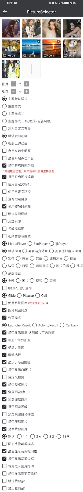|

| Default Style | Preview | Multiple Crop |
|:-----------:|:--------:|:---------:|
|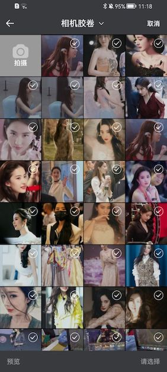 |  | 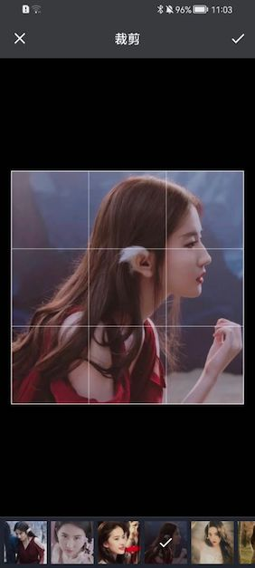|

| Digital Style | Preview | Multiple Crop |
|:-----------:|:--------:|:---------:|
|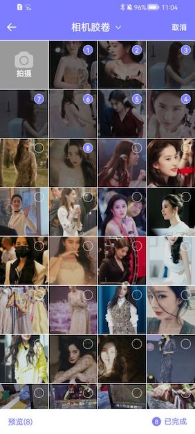 |  | 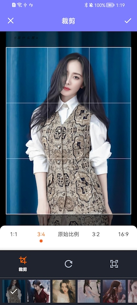|

| White Style | Preview | Single Crop |
|:-----------:|:--------:|:---------:|
|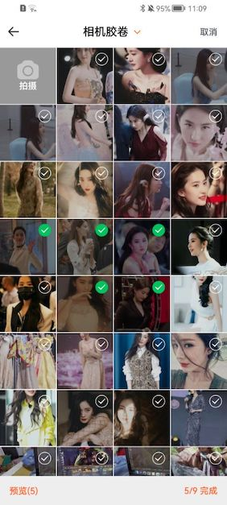 |  | 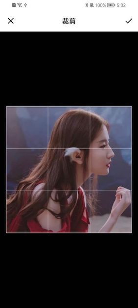|

| New Style | Preview | Multiple Crop |
|:-----------:|:--------:|:---------:|
|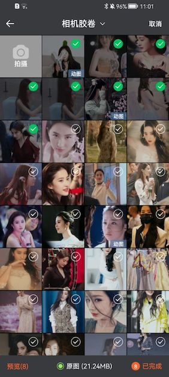 | 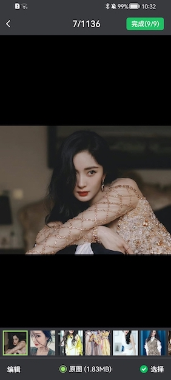 | 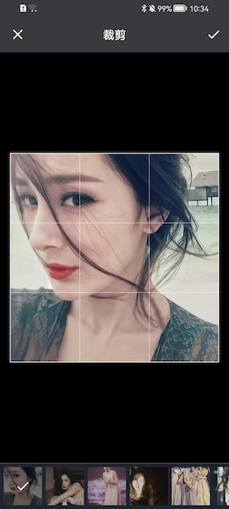|

| Photo Album Directory | Single Mode | Circular Crop|
|:-----------:|:--------:|:--------:|
|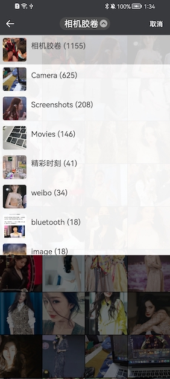 |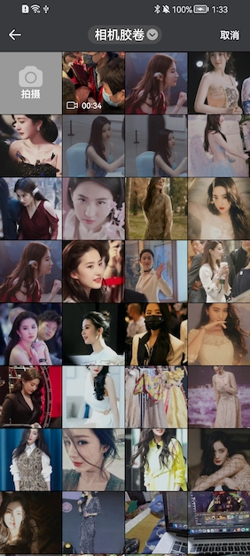 | |

| White Style | Video | Audio |
|:-----------:|:-----------:|:--------:|
|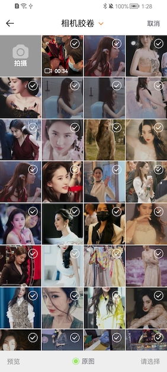 |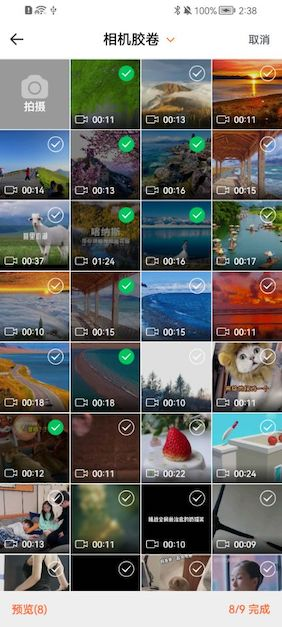 | 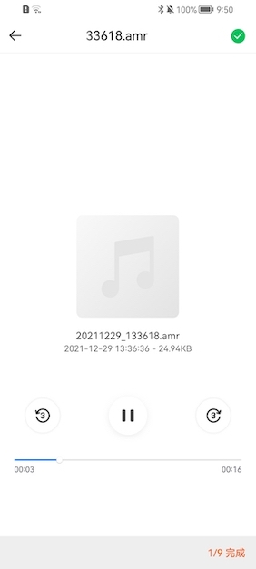|

